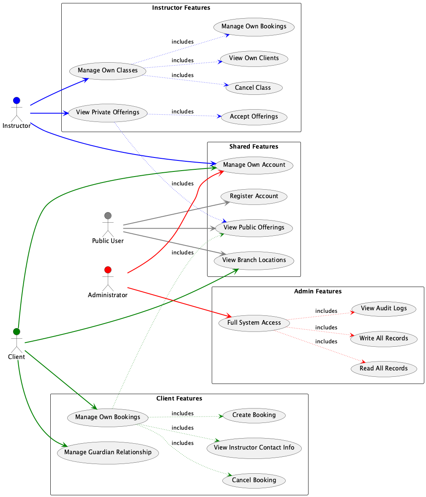

# soen-342-project

## Team Gymmy members:

- Huynh Minh, 40210039
- Elbannaoui Ossama, 40157112

## Description

Gymmy is a comprehensive fitness class booking system that enables users to find and book fitness classes across multiple locations. The system is designed with a modular architecture consisting of six main packages.

## Running:

```
1) install the requirements
    pip install -r requirements.txt
2) install posgrestsql however you find convenient
3) create a .secrets file in root (see .secrets_example)
4) run postgres_setup.py
5) run Main.py
```

## Demo:

The demo video can de found here: [Link](DemoSOEN342.mp4)

### OCL Test Cases

Our system implements several Object Constraint Language (OCL) tests with specific test cases to validate business rules:

#### 1. Unique Offering Per Location Test

**Test Data:**

```python
# Branch1: "Branch 1" in City A
# Branch2: "Branch 2" in City B
offering1 = (Branch1, 2023-12-01 10:00 - 11:00)
offering2 = (Branch1, 2023-12-01 10:30 - 11:30)  # Overlaps with offering1
offering3 = (Branch2, 2023-12-01 10:00 - 11:00)  # Same time but different branch
```

**Expected Result:** Test fails due to offering1 and offering2 overlapping at Branch1
**Error Message:** "Failed: Offering conflict at location Branch 1 and time slot 2023-12-01 10:00 - 11:00"

#### 2. Underage Client Guardian Test

**Test Data:**

```python
adult_client = (id="1", age=25)
underage_no_guardian = (id="2", age=16, guardian=None)
underage_with_guardian = (id="3", age=16, guardian_id="1")
```

**Expected Result:** Test fails for underage_no_guardian
**Error Message:** "Failed: Underage client Underage Client 1 (age 16) does not have a valid adult guardian."

#### 3. Instructor City Availability Test

**Test Data:**

```python
instructor = (id="1", name="Instructor A")
instructor.availabilities = [Branch1]  # Only available in City A
offering = (instructor=instructor, location=Branch2)  # Assigned to City B
```

**Expected Result:** Test fails as instructor is assigned to City B without availability
**Error Message:** "Failed: Offering city City B not in instructor Instructor A's availability."

#### 4. No Overlapping Bookings Test

**Test Data:**

```python
client = (id="1", name="Client A")
booking1 = (client, 2023-12-01 10:00 - 11:00)
booking2 = (client, 2023-12-01 10:30 - 11:30)  # Overlaps with booking1
```

**Expected Result:** Test fails due to overlapping bookings
**Error Message:** "Failed: Client Client A has overlapping bookings at 2023-12-01 10:00 - 11:00"

## UML Diagrams:

The UML Diagrams are written in PlantUML, both code and generated images are present in UML-Diagrams folder

### Use Case Diagram:



### Package Diagram:


## Relational Model

Below is a relational model built with DBDiagram to provide persistence to the application. 

[View Interactive Database Schema](https://dbdiagram.io/e/671bc56d97a66db9a34ae6a3/6733d1c6e9daa85aca3a306c)

## Bonus Developments

These were not implemented as they were not required explicitely

- Creating a GUI
- Implementing access control and auditing
