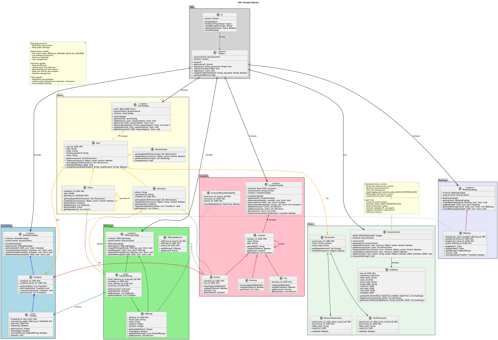

# soen-342-project

## Team Gymmy members:

- Huynh Minh, 40210039
- Elbannaoui Ossama, 40157112

## Description

Gymmmy offers it's users a flexible and practical to book fitness classes.

## UML Diagrams:

The UML Diagrams are written in PlantUML, both code and generated images are present in UML-Diagrams folder

### Main Structure:

Below is an overview of the packages and how they relate to each other. You may notice the image changing between sprints, that is normal.

## Relational Model

Below is a relational model built from the UML diagram to provide persistence to the application. Github does not support embedding so please use the URL.

[View Interactive Database Schema](https://dbdiagram.io/e/671bc56d97a66db9a34ae6a3/6733d1c6e9daa85aca3a306c)

