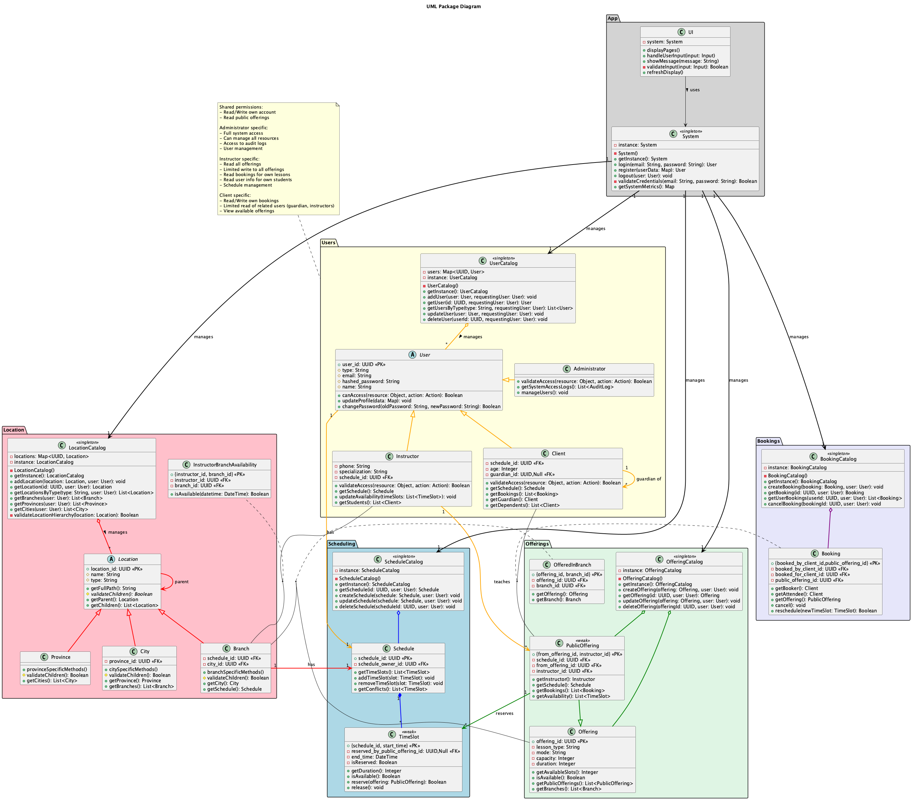

# soen-342-project

## Team Gymmy members:

- Huynh Minh, 40210039
- Elbannaoui Ossama, 40157112

## Description

Gymmmy offers it's users a flexible and practical to book fitness classes.

## Running:

```
1) install the requirements
    pip install -r requirements.txt
2) install posgrestsql however you find convenient
3) create a .secrets file in root (see .secrets_example)
4) run postgres_setup.py
5) run Main.py
```

## UML Diagrams:

The UML Diagrams are written in PlantUML, both code and generated images are present in UML-Diagrams folder

### Use Case Diagram:


### Package Diagram:



## Relational Model

Below is a relational model built with DBDiagram to provide persistence to the application. Github does not support embedding so please use the URL.


<iframe width="1920" height="1080" src='https://dbdiagram.io/e/671bc56d97a66db9a34ae6a3/6733d1c6e9daa85aca3a306c'> </iframe>


[View Interactive Database Schema](https://dbdiagram.io/e/671bc56d97a66db9a34ae6a3/6733d1c6e9daa85aca3a306c)

## Bonus Developments

These were not implemented as they were not required explicitely

- Creating a GUI
- Implementing access control and auditing
